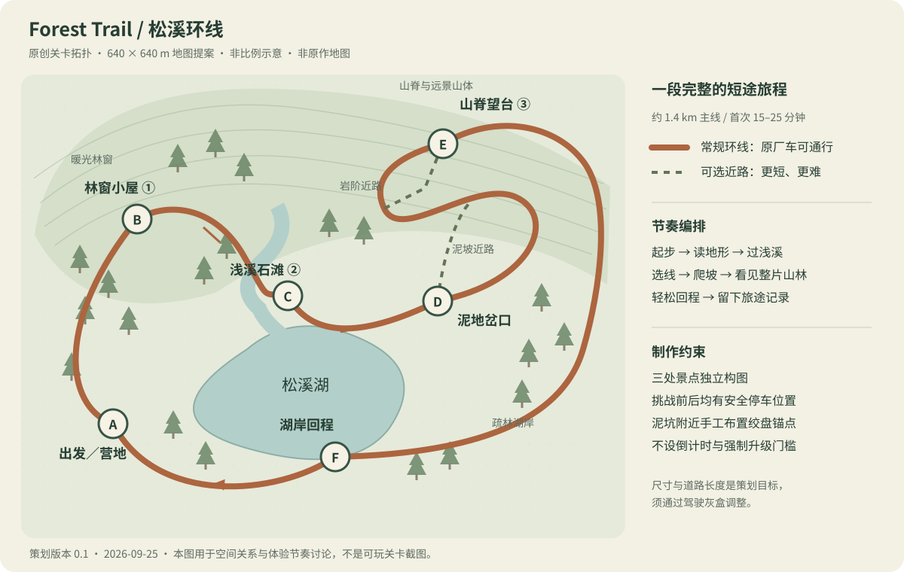

# Forest Trail 网页游戏策划案

版本 0.1｜2026-09-25｜原创网页游戏提案，受 over the hill 的越野探索体验启发。

本文的地图、数值、任务、名称、奖励和操作均为本项目方案，尚未实现。原作事实和证据另见[调研报告](01-original-game-research.md)。

## 1. 一句话与体验目标

驾驶一辆有重量感的老式四驱车，沿着森林里的溪谷和山路寻找三处风景，克服几段小困难，最后带着旅途照片回到营地。

**核心体验：车轮在脚下的地形上认真工作，树林在前方不断展开。** 玩家无需懂机械，但要学会慢一点、看路线、松油、换低档和偶尔使用绞盘。

| 项目 | 首版定义 |
| --- | --- |
| 形式 | 单人、第三人称、浏览器 3D，桌面键鼠可完整游玩，支持标准手柄 |
| 目标人群 | 喜欢驾驶、自然景观和轻探索，希望一小段时间放松的玩家 |
| 单次时长 | 首次完整旅程目标 15–25 分钟，完成后可继续自由驾驶 |
| 空间 | 一张约 640×640 米的手工地图；主环线约 1.4 km，少量支路 |
| 内容量 | 1 辆车，3 个风景点，6 段驾驶节奏，2 处有明确取舍的分岔 |
| 压力 | 无竞速倒计时；失败通过脱困或免费复位解决 |
| 长线动机 | 地点记录、一个可选轮胎升级、一件外观纪念；不做刷取经济 |
| 视觉基调 | 温带山林、雨后暖光、深绿树林、清浅溪谷；固定下午 |

## 2. 三条支柱及投入顺序

1. **可靠的低速驾驶。** 车身响应、四轮接地、抓地差异、制动和镜头先于内容数量。
2. **有编排的森林。** 手工保证转弯后的景观揭示、道路读取和林下视线；美术服务驾驶。
3. **温和的探索挑战。** 让玩家自己选择安全长路或困难短路，遇到问题能理解原因并再试。

建议投入比例：驾驶与镜头 40%，场景与光照 30%，关卡与探索 15%，声音、界面和存档 10%，整体验收 5%。这只是排优先级的方法；性能工作贯穿所有阶段。

## 3. 核心循环

看见地标 → 选择路径 → 驾驶并判断地表 → 必要时低档／倒车／绞盘 → 抵达景点 → 停车观察、拍照和记录 → 选择下一处。

两个并行层次：每几秒都有轮胎和路面的反馈；每两三分钟得到一种新的空间或景观。无需用持续弹出的任务提示维持注意力。

## 4. 明确范围

| 内容 | 首版处理 | 理由 |
| --- | --- | --- |
| 四轮接地、悬挂、重心、速度转向 | 必做 | 决定驾驶是否成立 |
| 高／低档、固定四驱 | 必做 | 少量操作产生清晰差异 |
| 干土、碎石／岩石、泥地、浅水反馈 | 必做 | 让选线有意义；水作为底层路面之上的介质 |
| 单绞盘与安全复位 | 必做 | 单人探索可自救 |
| 森林光照、雾、溪流、三处构图 | 必做 | 风景直接构成回报 |
| 简洁罗盘、纸面地图、景点记录 | 必做 | 支持探索而不淹没驾驶画面 |
| 停车摄影与本地进度 | 必做 | 完成旅程的记忆与回访 |
| 1 个可选轮胎升级、1 个纪念外观 | 基础体验通过后纳入首版 | 提供轻进度；不能成为主线通行门槛 |
| 真实可变形地形 | 不做 | 用表面参数与短时车辙反馈表达软土 |
| 自由放木板、拖曳车辆、营地建造 | 后续候选 | 会引入额外物理与交互复杂度 |
| 联机、动物图鉴、多个区域、大量车辆 | 不进入本轮 | 超出核心体验验证范围 |
| 动态天气、完整昼夜、第一人称内饰 | 后续候选 | 首先保证固定环境下的驾驶与美术 |
| 油耗、生存、复杂损伤、付费商店 | 不做 | 不符合这段低压力旅程的定位 |

## 5. 地图：松溪环线

这是拓扑与体验节奏示意，不是原作地图，也不是按比例建模图。地图外缘用陡岩、密林和深水组织自然边界，远山只作背景；明显不可达的区域不摆可互动标记。

| 段落 | 建议长度 | 体验与规则 | 景观回报 |
| --- | --- | --- | --- |
| A 营地 → B 林窗小屋 | 200 m | 宽土路、缓弯、低起伏，练油门制动 | 树林打开，小屋与暖光；第 1 处记录 |
| B → C 浅溪石滩 | 250 m | 根系和小石阶，推荐低档；上游有安全浅滩 | 溪水声逐渐出现；第 2 处记录 |
| C → D 泥地岔口 | 150 m | 干路进入短泥段，首次清楚感觉牵引差异 | 阴凉密林与湿亮路面 |
| D → E 山脊望台 | 主线 350 m | 较长碎石缓坡或短泥坡；接续石阶／平缓绕线 | 抵达后回望湖谷；第 3 处记录 |
| E → F 湖岸回程 | 300 m | 可控下坡，松油制动，不放突然断崖 | 高处视野变成湖岸倒影 |
| F → A 营地 | 150 m | 轻松土路，返回熟悉地标 | 旅程记录和照片，随后继续漫游 |

1.4 km 主线以约 6 km/h 的实际平均速度行进，纯驾驶约 14 分钟；观察和挑战再增加约 3–8 分钟，因此 15–25 分钟是有空间依据的目标。熟练玩家直达会更快，不用强制等待补足时长。

### 两处分岔

- **泥地岔口：**短泥坡约 80 m；外围碎石绕路约 180 m。玩家从入口就能看见两种材质和汇合方向，选错也能倒回。
- **山脊末段：**约 35 m 的岩阶近路；约 90 m 的缓坡回头弯。原厂车两条都可通行，升级轮胎只提高宽容度。

主线路宽约 4–5 m；挑战段可缩到 2.8–3.2 m，但镜头一侧留空间。常规纵坡先按 0–18° 设计，25° 的短坡留给挑战；侧坡明显更温和。先以驾驶测试决定能走多陡，再按该范围制作最终地形。

## 6. 前五分钟

| 时间目标 | 玩家经历 | 引导方式 |
| --- | --- | --- |
| 0:00–0:30 | 直接坐在车里，看见前方小屋，轻踩油门出发 | 屏幕角落只显示前进、转向、制动 |
| 0:30–1:30 | 通过缓弯和起伏，看见悬挂与车身反馈 | 第一段路不要求换档和开菜单 |
| 1:30–2:30 | 遇到小石坡，高档容易冲过头 | 停留时提示低档，旁边始终有平缓线路 |
| 2:30–3:30 | 抵达林窗，停车记录第一处风景 | 短提示“松溪小屋已发现”，地图上留下印记 |
| 3:30–5:00 | 从暗林驶向亮溪谷，选择浅滩入口 | 通过可见底床和石堤辨识路径；不做强制失败教学 |

第一次绞盘教学安排在之后的可选泥坑。提示只在连续受困时出现，不打断正在成功驾驶的玩家。

## 7. 输入与交互

| 动作 | 键鼠默认 | 标准手柄默认 |
| --- | --- | --- |
| 油门 | W / ↑ | RT |
| 制动、停稳后倒车 | S / ↓ | LT |
| 转向 | A/D / ←/→ | 左摇杆 |
| 手刹 | Space | B / 对应右侧面键 |
| 高低档 | Q | X / 对应左侧面键 |
| 环视 | 鼠标右键拖动 | 右摇杆 |
| 镜头回正 | C | 右摇杆按下 |
| 绞盘模式／退出 | E | Y / 对应上侧面键 |
| 确认锚点、按住牵引 | 绞盘模式内左键 | A / 对应下侧面键 |
| 复位至最近安全点 | 按住 R 1 秒 | 双肩键按住 1 秒 |
| 地图 | M | View / Select |
| 摄影与设置 | P；Esc 菜单也可进入 | Menu 后选择 |

按键为提案；实际需根据 Gamepad API 映射验证。绞盘模式必须停车进入；鼠标右键依然可观察，取消后恢复驾驶。S/LT 不允许前进中突然倒转动力：先制动，停稳后才倒车。失焦和断开手柄立即清空油门与转向。

## 8. 绞盘与失败恢复

车辆前方和后方各有一个预设连接点；低速停车后选择其一。候选锚点是约 18 m 范围内的指定树干／岩桩，显示能否连接、距离与阻挡原因。一次只连接一根绳，按住缓慢收紧，可配合低档油门；放开停止收绳，再按取消断开。

绳索不穿过岩壁；无效锚点不会显示为可选。最坏情况下可以长按 R 回到最近有效安全点，已完成景点保留。复位需渐隐并清空速度，不能让车辆瞬移到未到达的景点、正在泥坑中的姿态或其他障碍内部。

翻车、深水和卡底盘是旅途的小插曲，不扣货币、不删除记录。系统可以在受困 8 秒后提示工具，在 20 秒后提示复位，但不强制接管车辆。

## 9. 任务、奖励与存档

首版主目标：发现 B、C、E 三处风景点，并回到 A 营地。顺序自由；困难段均可绕行，三处景点不受升级门槛限制。

景点记录条件：进入合理停车区域，车速低于 1 km/h，按交互确认。摄影是可选的表达方式，不做图像识别评分，也不强迫玩家精确对准一个像素点。

可选支路放一个明显可发现的工具箱。找到它并发现任意一个景点，回营地即可装一套全地形轮胎；泥地牵引增益初始目标约 10–15%，不改变车宽、质量和主线是否可达。完成环线给一件车漆／徽章纪念。所有奖励一次性，不提供重复刷取。

存档记录安全点 ID、景点集合、已拾取工具箱、升级状态和设置；进入景点、回营地时保存。碰撞中的位置不直接作为读档出生点。照片由玩家主动导出；本地存储不可用时允许继续游玩，并明确说明本次进度只在会话内保存。

## 10. 界面与声音

驾驶 HUD 只常驻速度、高／低档、罗盘和下一处自选地标；地图按需打开。滑移、深水等反馈首先来自车体、路面和声音，必要提示短暂出现。不给正常驾驶常驻显示工程调参值。

菜单：继续、地图／记录、摄影、操作、画质、声音、回营地。摄影可调整镜头角度并隐藏 HUD；单人暂停物理，恢复后清空遗留输入。引擎声音由负载和转速代理共同控制，不能只由车速控制，否则泥地空转听起来会失真。

## 11. “做成了”的判定

- 新玩家不看长教程，1 分钟内起步并转弯，5 分钟内理解低档的用途。
- 原厂车能完成整条主线；玩家能从外观辨识泥地与安全绕路。
- 在石阶、泥地和坡道上，感觉到三种不同驾驶问题；不是统一降低速度。
- 三个观景点都值得停车，驾驶途中没有持续遮挡车辆的树冠。
- 任一受困状态有自救或免费复位，重试不重复整个旅程。
- 满足[驾驶验收](04-driving-spec.md)和[性能／制作阶段条件](05-web-production-plan.md)。

首版目标是可完整体验的短篇。后续是否扩展雨天、另一辆车或协作，取决于驾驶和森林是否已经成立。
