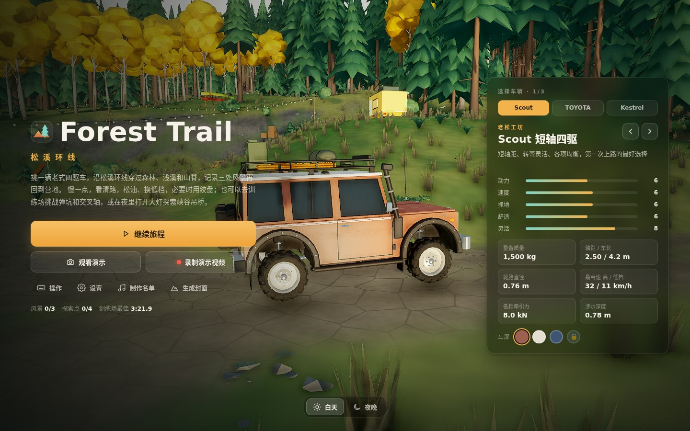

# Forest Trail · 松溪环线

**[在线试玩](https://warren-swr.github.io/forest-trail/)** · [游戏说明与操作](game/README.md) · [演示视频](game/docs/demo.mp4) · [横版实景图](game/docs/screenshots/landscape/README.md)

单人第三人称 3D 森林越野网页游戏。挑选一辆老式四驱车，穿过森林、浅溪与山脊，记录风景；也可以挑战越野训练场、探索峡谷吊桥，或在夜里打开大灯自由驾驶。



游戏已实现三辆可选车辆、四轮悬挂与绞盘、昼夜与车灯、背景音乐、训练场计时、演示录制及本地存档。使用支持 WebGL2 的桌面浏览器，按 W/A/S/D 驾驶、M 打开地图、Esc 暂停；完整操作见 [game/README.md](game/README.md)。

## 本地运行

需要 Node.js 22.12 或更新版本。

```bash
cd game
npm ci
npm run dev
```

`npm run build` 执行类型检查并输出纯静态站点到 `game/dist/`；`npm run preview` 可预览构建结果。源码、原创模型与生成脚本位于 `game/`，实际开发验证记录见 [game/docs/VERIFICATION.md](game/docs/VERIFICATION.md)。

## GitHub Pages

推送到 `main` 后，[部署工作流](.github/workflows/deploy-pages.yml)会自动安装依赖、构建游戏并发布到 **https://warren-swr.github.io/forest-trail/**。也可以在仓库 Actions 中手动运行 `Deploy to GitHub Pages`。

发布目录为 `game/dist/`，Vite 使用相对资源路径，适配 `/forest-trail/` 子目录。背景音乐的来源、许可证与署名见 [game/docs/CREDITS.md](game/docs/CREDITS.md)，游戏内“制作名单”也保留了署名。

## 初期调研与策划

以下为 2026-09-25（Asia/Shanghai）的 0.1 版立项资料，记录开发前的研究与方案；当前游戏内容和验证结果以 `game/` 下的文档为准。

**建议做一款单人、第三人称、15–25 分钟的森林越野探索游戏：一辆老式四驱车，一张精心编排的森林地图，靠观察路线、控制油门和使用绞盘抵达风景点。把开发投入集中在驾驶手感、镜头和森林画面。** 项目名称统一为 **Forest Trail**。

原作目前尚未正式发售，[Steam 官方商店](https://store.steampowered.com/app/2929250/over_the_hill/)与[官方 FAQ](https://steamcommunity.com/app/2929250/discussions/0/554627937323741779/)均列出 **2026-10-14**。本调研核对官方页面、开发公告、开发者问答、两篇媒体试玩，并逐张观察官方截图；没有亲自运行原作，没有把视频标题当成已观看的动态证据。

## 先看这些

| 文件 | 内容 |
| --- | --- |
| [策划案](03-game-design.md) | 产品定位、核心循环、范围取舍、地图、操作、任务和完整游玩流程 |
| [原作机制研究](01-original-game-research.md) | 已确认机制、试玩反馈、设计推论与证据边界 |
| [画面与森林研究](02-visual-direction.md) | 官方图片拆解、森林构图、光照、地表与车辆视觉规范 |
| [驾驶体验规格](04-driving-spec.md) | 悬挂、轮胎、转向、坡道、泥地、涉水、绞盘、镜头及调校场景 |
| [网页实现与开发计划](05-web-production-plan.md) | 技术路线、性能预算、分期、工作量假设、通过条件 |
| [素材目录](06-asset-catalog.md) | 14 张官方参考图、3 套可复用素材、许可、用途与缺口 |
| [来源与视频索引](07-sources.md) | 官方和辅助来源、日期、用途、失效入口、未观看视频清单 |
| [离线图文参考板](reference-board.html) | 可直接在浏览器打开；完整截图、逐图批注、素材预览和关卡示意 |
| [原创关卡示意图](design/forest-loop.svg) | 本方案的空间与体验节奏；不是原作地图 |

## 方案的三项承诺

1. **车确实在走地形。** 四轮接地、车身俯仰侧倾、坡上回退、不同地表的抓地与阻力可以辨认。
2. **森林值得开进去。** 林下阴影、林窗、溪谷和高处远眺交替出现，路面和危险始终读得清楚。
3. **受挫后仍想继续。** 每个难点提供绕路或自救，免费复位，不依靠倒计时、燃料或反复刷取延长时长。

第一步做一条约 100 米的驾驶试验路，第二步做 300 米森林片段，二者验收后才扩展完整环线。单纯“车辆能移动”或“截图好看”都不算核心体验完成。

## 资料边界与目录

`assets/reference/` 为原作官方截图，仅作研究参考，未获得作为新游戏美术资产使用的授权。`assets/reusable/` 是 Kenney 提供的三套 CC0 素材包，原包、许可和包内目录均已保留。可复用素材仍需统一尺寸、风格及碰撞体。

```text
forest-trail/
├── README.md
├── 01-original-game-research.md … 07-sources.md
├── reference-board.html
├── design/forest-loop.svg
├── assets/
│   ├── reference/steam-01.jpg … steam-14.jpg
│   ├── reusable/                  # ZIP、许可、预览、文件清单
│   └── manifest.json              # 下载地址、来源、字节数、SHA-256
├── sources/steam-media-metadata.json
├── sources/material-audit.json
├── checks/verification.json
└── tools/collect_materials.py
```

数字参数、性能预算、制作周期均为**本方案的起始假设**，不是原作内部参数，也不是已经跑出的测试结果。原作结论优先看 `01` 的证据分级；素材完整性检查见 `checks/verification.json`。
