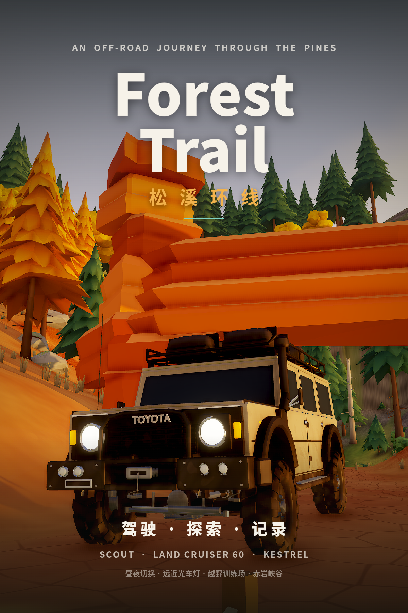
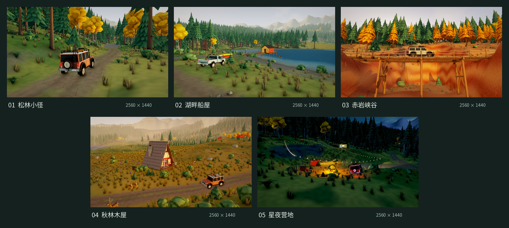

# Forest Trail · 松溪环线

**[在线试玩](https://warren-swr.github.io/forest-trail/)** · [GitHub 仓库](https://github.com/Warren-swr/forest-trail)



单人第三人称 3D 森林越野网页游戏。从三辆风格不同的老式四驱车里挑一辆：
- 沿松溪环线记录三处风景（林窗小屋、浅溪石滩、山脊望台），最后回到营地；
- 旅程之外可以继续自由驾驶：去越野训练场挑战弹坑和交叉轴、刷新计时，穿过赤岩峡谷的木板吊桥，或者在夜里开着远光灯探索森林。

技术栈：Vite + React + TypeScript + PlayCanvas 2.22（3D）+ Rapier 3D（刚体与碰撞）+ WebAudio（合成音效与背景音乐）。

演示视频：[docs/demo.mp4](docs/demo.mp4)（126 秒，1080p，由游戏内“录制演示视频”按钮录制）。

## 横版实景图

[查看 5 张原图](docs/screenshots/landscape/README.md)（2560×1440，16:9）：松林小径、湖畔船屋、赤岩峡谷、秋林木屋与星夜营地，均由当前游戏实机取景。

[](docs/screenshots/landscape/README.md)

## 主要内容

- **三辆车：**
  - **Scout 短轴四驱：**均衡，首版车，第二版升级了细节并修复了前悬挂穿模。
  - **TOYOTA Land Cruiser 60 旅行车：**长轴、重、稳，扭矩大，带通气管，涉水更深。
  - **Kestrel 小皮卡：**轻、快、软，低档扭矩最小。

  三辆车的物理参数和车型都不同，悬挂在极限姿态下都没有穿模，泥污会累积在车身上。
- **昼夜与车灯：**
  - 天空是 GPU 程序化生成的，有太阳、云、星空和月亮；白天与夜晚之间平滑过渡。
  - 夜里有篝火、串灯、窗灯，营地和草甸上空有萤火虫。
  - 车灯可以开关，并在近光和远光之间切换：近光带截止线，远光照得更远，并联动灯排和雾灯。
- **颠簸路面与新区域：**
  - 路面：炮弹坑、交叉轴、连续起伏、搓板路、侧倾坡、原木台阶、岩石花园。
  - 越野训练场：7 对旗门计时，保存最佳成绩。
  - 赤岩峡谷：砂岩、天然石拱，还有可以开车通过的吊桥。
  - 秋色林与 A 字木屋、湖畔船屋、营地夜景。
  - 立体雪山和瀑布、风吹植被，以及会被车惊跑的鹿群和盘旋的鹰。
- **背景音乐：**白天、夜晚、标题 / 演示三组歌单，曲目切换时交叉淡入淡出。曲目来自 Kevin MacLeod（incompetech.com，CC BY 4.0），见 [docs/CREDITS.md](docs/CREDITS.md)。
- **现代界面：**磨砂面板风格，包括选车卡片、环形速度表、车灯与档位状态、训练场计时和侧栏式暂停菜单。
- **演示模式：**约 2 分钟的自动运镜展示，可以一键录制成 WebM 下载；还能一键生成 1200×1800 的竖屏封面。

## 启动

需要 Node.js 22.12 或更新版本（已在 22.23 上验证），以及一块支持 WebGL2 的显卡。在 `game/` 目录下运行：

```bash
npm ci
npm run dev      # 开发服务器 http://localhost:5173
npm run build    # 类型检查 + 生产构建，输出到 dist/
npm run preview  # 本地预览 dist/
```

`dist/` 是纯静态文件（`base: './'`），可以直接放到任意静态服务器上。

URL 参数：
- `?play`：跳过标题页；
- `?debug`：显示驾驶遥测（速度、油门、悬挂长度、载荷、地表、安全点、绞盘张力、绘制调用数）。

## 操作

| 动作 | 键鼠 | 标准手柄 |
| --- | --- | --- |
| 油门 | W / ↑ | RT |
| 制动；停稳后倒车 | S / ↓ | LT |
| 转向 | A D / ← → | 左摇杆 |
| 手刹 | Space | B |
| 高 / 低档 | Q | X |
| 大灯开 / 关 | L | 十字键上 |
| 远光 / 近光 | B | 十字键右 |
| 白天 / 夜晚 | N | — |
| 环视（1.5 秒后自动回正） | 按住右键拖动；滚轮调远近 | 右摇杆 |
| 镜头回正 | C | 右摇杆按下 |
| 绞盘：选锚点 / 断开 | E | Y |
| 绞盘：连接；按住收绳 | 左键或 F | A |
| 记录风景点 / 探索点 / 拾取工具箱 | F | A |
| 复位到最近安全点 | 按住 R 1 秒 | 按住 LB+RB 1 秒 |
| 地图 | M | View |
| 摄影模式 | P | — |
| 暂停菜单 | Esc | Menu |

标题页可以选车、切换昼夜、观看或录制演示、生成封面。暂停菜单的“车辆与涂装”里可以随时换车。

## 目录

```
src/game/world/     地图布局（layout.ts）、地形合成与颠簸路面、新区域摆放（areas.ts）、植被与岩石散布
src/game/physics/   Rapier 世界、自写四驱车模型（按 VehicleSpec 参数化）、绞盘
src/game/render/    地形、实例化森林与风动、天空与昼夜、远山与瀑布、车辆视图与泥污、车灯、夜间灯光、野生动物、粒子
src/game/           主循环、旅程规则、训练场计时（park.ts）、演示导演（director.ts）、封面（cover.ts）、镜头、输入、音频、存档
src/ui/             React 界面：标题与选车、HUD、暂停菜单、地图、演示字幕层
art/blender/        全部 3D 资产的 Blender Python 源脚本（车辆共享零件库、三辆车、穿模检测、植被、岩石、道具）和 .blend 文件
public/assets/      导出的 GLB 模型、车辆挂点 JSON、背景音乐
tools/              无头试验场、路线测试、地图预览
docs/               方案文档、验证报告、开发计划、素材来源、截图、封面、演示视频
```

## 测试与工具

```bash
npm run test:proving                # 三辆车依次跑驾驶验收 D01–D12（结果写入 tools/proving-results*.json）
npm run test:lap                    # 自动驾驶跑完整条环线；VEH=toyota|ranger 选车，FULL=1 加载全部静态碰撞体
npx tsx tools/sim-test.ts park      # 自动驾驶跑完越野训练场（同样支持 VEH=...）
npx tsx tools/sim-test.ts canyon    # 自动驾驶穿过赤岩峡谷和吊桥
npm run test:drive                  # 起步、制动、驻停、泥地与岩阶数据
npm run map                         # 生成地图预览 docs/map-preview.png 并打印各路段坡度
npm run assets                      # 用 Blender 重新生成全部模型、预览图、车辆 JSON 和 asset-report.json（需安装 Blender 4.x）
```

## 文档

- [docs/PLAN-v2.md](docs/PLAN-v2.md)：第二版开发计划。
- [docs/DESIGN.md](docs/DESIGN.md)：方案文档，记录所有实现取舍；第二版内容在第 13 节。
- [docs/VERIFICATION.md](docs/VERIFICATION.md)：实际验证过程与结果、性能数据、剩余限制、截图索引。
- [docs/CREDITS.md](docs/CREDITS.md)：背景音乐来源、许可证与署名。

除背景音乐外，所有模型、贴图和音效都是本项目原创（程序化生成）。
