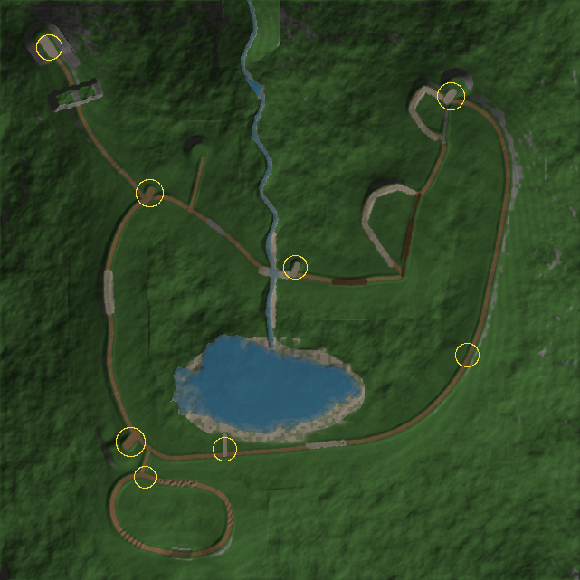

# Forest Trail 方案文档

本文记录实现采用的方案和所有取舍，重点写与调研文档（`../README.md`、`03-game-design.md`、`04-driving-spec.md`、`02-visual-direction.md`、`06-asset-catalog.md`）不同的地方和原因。本任务在无人值守会话中完成，下列决定都由实现者自行做出。第 1–12 节描述首版并已按第二版更新；第二版新增的系统和取舍集中写在第 13 节，执行计划见 `PLAN-v2.md`。

**结论：**首版覆盖了策划案第 4 节“必做”和“首版纳入”的全部内容，包括驾驶、两处分岔、三种地形挑战、绞盘与复位、三处景点记录、工具箱与轮胎升级、纪念车漆、自由探索、新手提示、暂停、声音、存档和摄影。主要偏差有四处：环线比设计长约 270 m、车速上限按驾驶规格而非时长倒推、森林资产全部原创没有使用 Kenney 包、地图在加载时程序化生成而不是预先烘焙。

## 1. 技术选型

| 领域 | 选择 | 理由 |
| --- | --- | --- |
| 3D 引擎 | PlayCanvas 2.22 | 任务指定（覆盖调研中的 Three.js 推荐）。用到了它的实例化、级联阴影、CameraFrame 后处理（ACES、SSAO、泛光、调色、暗角、摄影景深）和基于天空立方体贴图的环境光。 |
| 物理 | Rapier 3D（compat 版，WASM 内联进 JS 包） | 只用它的刚体、碰撞和射线查询。**车辆模型是自写的**，没有用 Rapier 的 DynamicRayCastVehicleController：内置车辆单射线、参数语义和单位不透明，无法做台阶爬越、摩擦圆和打滑代理。自写模型全部使用 SI 单位，可以在 Node 里无头测试。 |
| UI | React 19 | HUD、菜单和地图。游戏循环和 React 通过一个小型可订阅存储交换状态（`src/game/store.ts`），每帧最多通知一次；HUD 以 20 Hz 刷新车速等数值。未使用 StrictMode，避免引擎被创建两次。 |
| 音频 | WebAudio 实时合成 + 流式背景音乐 | 音效全部由振荡器和噪声合成。第二版加入背景音乐：Kevin MacLeod 的 5 首 CC BY 4.0 曲目，来源和署名见 `CREDITS.md`。 |
| 构建 | Vite 8 + TypeScript 5.9 | `npm run build` 先做 `tsc -b` 类型检查，再打包；产物是纯静态文件。 |

## 2. 运行架构

- **固定步长：**物理 60 Hz，用累加器驱动，每帧最多补 4 步；超出后丢弃积压，避免卡顿后一次补几秒把车弹飞。渲染在两次物理快照之间插值车身位置、姿态和悬挂长度。切出标签页时清空时间积压和输入。
- **单次世界生成：**地形、道路、材质、水面、植被和碰撞体都由 `src/game/world/` 里的确定性代码在加载时生成（约 2.5 秒）。好处是只需一份手写布局文件（`layout.ts`）就能迭代地图，Node 工具和游戏看到的是同一个世界。代价是首次加载要多等几秒，已在加载页显示分阶段进度。
- **模块：**`Game.ts` 负责引导和主循环；`journey.ts` 是旅程规则；`physics/vehicle.ts` 是车辆；`physics/winch.ts` 是绞盘；`camera.ts` 是跟车镜头；`audio.ts` 是合成音频；`render/*` 是各类渲染；`boot.ts` 负责界面流程、按键路由和调试接口 `window.__ft`。

## 3. 车辆物理

车身是 Rapier 动态刚体。质量和惯量由代码直接指定，四个碰撞盒只负责碰撞，不参与质量计算。

| 参数 | 取值 | 说明 |
| --- | --- | --- |
| 质量 | 1500 kg | 规格起点 |
| 重心 | 车身原点上方 0.2 m，约离地 0.6 m | 略低于车体外观中心 |
| 转动惯量（俯仰 / 偏航 / 侧倾） | 2500 / 2700 / 700 kg·m² | |
| 轴距 / 轮距 / 轮胎半径 | 2.5 / 1.65 / 0.38 m | 与模型一致 |
| 弹簧自由长度 / 最短长度 | 0.42 / 0.12 m | 静态约 0.30 m，工作行程 0.30 m |
| 弹簧刚度 | 30 kN/m | 静态压缩约 0.12 m |
| 阻尼 | 压缩 3.6、回弹 5.2 kN·s/m | 阻尼比约 0.7 |
| 限位块 | 260 kN/m，单轮最大 45 kN | 设上限，防止深度压入时把车弹起 |
| 防倾（前 / 后） | 9 / 6 kN/m | 用来近似整体桥的左右耦合 |

**车轮接地：**每个车轮沿轮胎下半圆打 7 条射线，取压缩量最大的那条。落在前方射线上的台阶或岩石会产生指向轮心的接触法线，所以台阶会“顶”住车轮，驱动力沿切线把车轮抬上去。地形用解析的双线性高度求交，其他障碍用 Rapier 射线。这样做也绕开了 Rapier 高度场射线正好落在网格线上时偶尔穿透的问题。

**轮胎模型：**

- **横向：**刷子松弛模型，`d(位移)/dt = v横 − |v纵|/σ · 位移`，σ = 0.7 m，刚度 60 kN/m。静止时不会蠕移，速度越高侧偏刚度越接近常规值。
- **纵向：**制动用带上限的“静摩擦弹簧”，可以可靠驻停。驱动力按四轮载荷分配，相当于前后差速锁。
- **摩擦圆：**纵向与横向合力不超过 μN。驱动需求超过抓地时进入打滑状态，抓地按超出比例最多降到 80%，这就是“松一点油门反而爬得上去”的来源。
- **阻力不占抓地：**滚动阻力和泥地黏滞阻力在摩擦圆限制之后叠加，不消耗抓地额度。调试中发现，如果把它们算进摩擦圆，泥里四轮都在打滑，车却照样能爬坡。

**动力：**

| 档位 | 峰值驱动力 | 目标最高速度 | 发动机制动 |
| --- | --- | --- | --- |
| 高档 | 5 kN | 31.5 km/h | 1 kN |
| 低档 | 8 kN | 10.5 km/h | 3.2 kN，下坡能控速但不会完全抵消重力 |
| 倒档 | 6.5 kN | 8.5 km/h | |

接近最高速度时驱动力用平滑曲线收束，不硬截断。

**输入：**

- 键盘油门 0→1 用时 0.35 秒，松开 0.18 秒；可选“细腻油门”，把增长时间放慢到 1.1 秒，但不改变最大爬坡能力。
- W/S 反向输入先制动，停稳 0.2–0.25 秒后才换向。
- 松开油门且坡度小于 5° 时自动驻停；更陡的坡上松油会后溜，符合规格“松油允许后退”。
- 最大转角从 32° 随车速降到 30 km/h 时的 14°，有转向速率限制和 Ackermann 转向几何。

**地表：**每个车轮查询 0.5 m 分辨率的材质图，双线性混合，过渡带约 1 m。

| 地表 | 牵引倍率 | 滚动阻力倍率 | 其他 |
| --- | --- | --- | --- |
| 干土 | 1.0 | 1.0 | |
| 草地 | 0.86 | 1.35 | |
| 碎石 | 0.84 | 1.25 | |
| 岩石 | 1.02 | 0.8 | |
| 泥地 | 0.42 | 4.5 | 另加 650 N/(m/s) 的黏滞阻力；轮胎下陷 7 cm，地形本身也有 10–12 cm 的泥坑 |

- 这里的泥地牵引比规格建议（0.45–0.60）低一点。原因是规格里的其他数值会让泥地几乎感觉不到差异；按现在的取值，泥地同油门行驶距离约为干土的 62%（试验场 D05）。
- 水中牵引 ×0.9，并有随水深增加的水阻。
- 全地形轮胎：泥地牵引 ×1.14，其余地表 ×1.05。

**稳定性：**没有加防侧翻辅助，也没有脚本化翻车。30° 侧坡直线横行不会翻，满舵转弯会翻，风险来自物理本身（试验场 D07）。

## 4. 地图：松溪环线

640 × 640 m 手工布局，高度网格 1 m。地形合成流程：

1. 用道路控制点高度、湖、溪和四周山脊作为约束，做 8 m 网格的拉普拉斯松弛，得到大形。
2. 叠加 fbm 起伏，离路越远起伏越大。
3. 雕出溪流和湖盆。
4. 按道路距离场把地形并入路面剖面，路肩宽度随高差增大。
5. 压出泥坑、推平建筑平台。

道路剖面是控制点之间的单调三次插值，另加轻微的纵向起伏和车辙，让悬挂一直有事可做。

| 段落 | 设计长度 | 实际长度 | 说明 |
| --- | --- | --- | --- |
| A 营地 → B 林窗小屋 | 200 m | 279 m | 宽土路，途中有一段嵌石碎石坡（新手提示换低档） |
| B → C 浅溪石滩 | 250 m | 171 m | 根系与小石阶（静态碰撞体），下坡进入溪谷 |
| C → D 泥地岔口 | 150 m | 144 m | 浅滩水深 0.23 m，之后是 30 m 平缓泥段 |
| D → J1（碎石绕路 / 泥坡近路） | 180 / 80 m | 161 / 92 m | 近路最陡 12.4°，原厂胎需要控油门，也可用绞盘 |
| J2 → E（缓坡回头弯 / 岩阶近路） | 90 / 35 m | 110 / 46 m | 岩阶用石板碰撞体做出 15–25 cm 台阶，最陡约 26° |
| E 山脊望台 → F 湖岸 | 300 m | 522 m | 东侧长下坡，低档可控速 |
| F → A | 150 m | 220 m | 湖岸土路，路北侧留出林窗看湖 |

- 主环线 1671 m，比设计的 1.4 km 长约 270 m。原因是在 640 m 地图里要把山脊抬到 40 m、保证主线纵坡不超过 12°，同时让湖岸段看得见湖。
- 主线最大纵坡 12°，平均 3.6°，低于规格 18° 的上限：原厂车高档就能跑完主线，挑战集中在近路上。
- 旧锯木场支路长 60 m，尽头放工具箱。
- 自然边界：四周是高 30–90 m 的山坡，外加离地图边缘 18 m 的隐形墙；远处有三层雾色山脊做背景。
- 深水只出现在湖中心，湖岸有缓坡和颜色预警。

**时长：**自动驾驶以约 21 km/h 跑完一圈要 5 分钟。按规格，高档目标最高速度是 30 km/h，不能为了拉长时长去压车速。普通玩家在弯道、泥地、岩阶和景点停车记录上会花更多时间，首次旅程预计 12–20 分钟，略短于策划案 15–25 分钟的目标。这是有意的取舍：宁可短而不无聊，也不硬性限速。

## 5. 镜头

跟车距离 7.2 m、高度约 3.2 m、垂直视野 55°，注视车前 3–5.5 m 处（随车速增加）。

- 偏航用阻尼跟随，不跟随车身翻滚。
- 右键环视后，1.5 秒无输入会平滑回正；按 C 立即回正。
- 镜头到车之间对树干和岩石做射线检测：遇到遮挡快速拉近，离开后缓慢拉远；地形沿线检测，保证镜头不入地。
- 撞击时有轻微镜头抖动，可以在设置里关闭。
- 绞盘选点时镜头抬高拉远。
- 景点记录时镜头平滑飞到预设机位，加电影黑边和标题。

## 6. 玩法规则

- **景点记录：**进入停车区、车速低于 1.2 km/h、按 F。之后播放约 4 秒定格镜头，自动截取 480×270 缩略图存入手账。顺序自由，已记录的景点可以重拍。
- **安全点：**沿所有道路每 35 m 一个，跳过水中和泥中的点。四轮着地、车身基本水平、不在水里或泥里时，经过 5.5 m 内的点就记为最近安全点。
- **复位：**按住 R 一秒，画面淡出后回到最近安全点，车头朝向与原行驶方向一致；速度清零，车身贴合地面法线，进度保留。深水（>0.78 m）持续 3 秒会自动复位；水深超过 0.55 m 时显示警告。
- **求助提示：**受困 8 秒后提示低档、倒车换线和绞盘（泥里提示松油再轻踩）；20 秒后提示复位；翻车 1.5 秒后提示复位。求助提示优先于新手提示。
- **绞盘：**
  - 车速低于 2 km/h 才能按 E 进入选点。
  - 18 m 内的指定锚点（共 18 个：泥地两处、岩阶、浅滩、根系段、碎石坡和回头弯）用光环标出；优先选取镜头方向上可连接的那个。
  - 车头或车尾连接点按锚点方位自动选择。
  - 连接前做视线检测，被地形或障碍物挡住的锚点会注明原因、不可连接。
  - 绳索只拉不推：收绳 0.75 m/s，张力上限 11 kN，平滑加力，向上分力限制在张力的 30% 以内，最短绳长 3.5 m。
- **工具箱与升级：**工具箱在旧锯木场支路尽头。拾取后，只要至少记录过一处景点，回营地停稳就会换上全地形轮胎。升级只提高宽容度，两条近路原厂胎都能通过（试验：泥坡近路原厂胎全油门 41.5 秒、八成油门 37.3 秒爬上；全地形胎 33–36 秒）。
- **完成：**三处景点都记录后回营地，按 F 记录终点，弹出旅程手账，解锁纪念车漆“松林绿”，之后自由探索。
- **存档：**`localStorage` 键 `forest-trail/save`，版本号 1。内容包括已记录景点、照片缩略图、工具箱、升级、完成状态、车漆、安全点序号、设置和旅程用时。在记录景点、拾取、升级、完成、修改设置时保存，行驶中每 20 秒也会保存一次。读档从安全点出生，不从碰撞中的位置出生。存储不可用时退回内存，并在标题页和提示里说明。照片过大超出配额时先丢照片再保存。
- **新手提示：**只在首次游玩时出现，按驾驶距离和位置触发：起步操作 → 环视与地图 → 碎石坡前提示低档 → 泥地前提示控油和绞盘。

## 7. 视觉

- **色板：**沿用视觉文档自定色板，包括深林阴影、松针、苔藓、暖草、干土、湿泥、雾色和赭红车漆。固定为下午暖光，太阳在西南偏西、高度约 27°。
- **地表着色：**自定义 PlayCanvas `diffusePS` 和 `glossPS` 片段，用 RGBA 材质图（土 / 泥 / 碎石 / 岩石，草地是余量）和辅助图（车辙、草脊、湿润度、林冠密度）在着色器里混合。
  - 土路是双车辙，中间有断续的草脊。
  - 泥地有水洼和干壳，湿处更亮。
  - 岩石有层理、裂缝和苔斑。
  - 林下是针叶腐殖层。
  - 纹理细节全部是程序化梯度噪声，没有贴图。早期用值噪声会出现方块感，已改为旋转梯度噪声。
- **森林：**
  - 约 1.4 万棵树，按抖动网格散布，由林分噪声控制密度。路边 2.4–9 m 逐渐变稀，林窗和平台周围清空，溪谷和湖岸专门留出视野。
  - 金色山杨只点缀在林窗边缘。
  - 每个景点的定格镜头会生成一个半角 42° 的视锥（覆盖 16:10 画面的水平视角），树顶高于视线的树不种或换成矮松，这样山脊望台能看到湖谷。
  - 树干和岩石有 Rapier 碰撞体（路两侧 40 m 内）。
- **LOD 与实例化：**
  - 树按 110 m 分块实例化，分三档：60 m 内高模，150 m 内低模投影，460 m 内低模不投影。
  - 灌木和蕨类在 110 m 内显示；近处密草（约 12 万丛）只在 40 m 内显示。
  - 地形按 64 m 分块，分三级 LOD，块边有裙边防裂缝。
  - LOD 切换通过启用或禁用实体实现。调试中发现，只切换 `meshInstance.visible` 对阴影和深度预渲染无效，会把 5900 万三角面全画出来。
- **天空与光照：**CPU 生成半精度天空立方体贴图（渐变、太阳光晕、薄云），用它生成环境光照集。平行光使用 3 级级联阴影，覆盖 150 m。
- **雾：**改写雾片段，加入高度衰减（谷底更浓）和朝太阳方向的暖色散射，起点 45 m、终点 640 m。视觉文档要求“薄雾”，早期雾太浓，把山脊望台远处的湖吞掉了，已调淡。
- **水：**湖和溪分别建网格。顶点色按水深给出浅绿到深青的颜色和透明度，浅水能透出河床；两层滚动法线贴图，天空反射，岸边有泡沫。
- **后处理：**ACES 色调映射、轻度 SSAO、弱泛光、调色和暗角。抗锯齿用 4× MSAA 而不是 TAA：TAA 在行驶中会把前景拖出残影。
- **驾驶反馈：**
  - 粒子：干土和碎石扬尘，泥地打滑甩泥点，涉水溅水花，共 420 个 CPU 粒子，合成一个动态网格绘制。
  - 车辙：900 段，60 秒内淡出，泥里更深。
  - 悬挂、轮胎转动、整体桥摆动、弹簧伸缩和传动轴都跟随物理实时更新。

## 8. 资产

全部 3D 资产由 `art/blender/*.py` 在 Blender 4.5 中程序化建模，并附带 `.blend` 源文件。`npm run assets` 可以一键重建全部 GLB、预览图和 `art/asset-report.json`（面数、包围盒、节点、材质、LOD 比例、车辆安装点）。

- **车辆：**Body 约 8.8k 三角面，Wheel、AxleFront、AxleRear、Spring、Driveshaft 分节点导出；游戏里组装成 4 轮、2 桥、4 弹簧、2 传动轴，共约 1.8 万三角面。
- **植被：**10 种，每种都有 LOD1（约为高模的 1/6–1/4）。
- **岩石与木头：**8 种。
- **建筑与道具：**12 种。

植被、岩石和道具都用单一顶点色材质，风格统一，下载量小（全部 GLB 共 2.1 MB）。

- **没有使用 Kenney CC0 包。**首版的目标是统一的低多边形顶点色风格；混入外部素材会带来比例和色板不一致的问题，而程序化脚本可以按色板和尺寸精确控制，所以全部原创。原作截图只用于研究构图，没有进入项目。

## 9. 音频

- **引擎：**两组失谐锯齿波加方波次声，经过软削波，再过随负载变化的低通。转速代理由轮速、档位、油门和打滑共同决定，所以泥里空转时转速会升高。第二版按车型给出怠速、红线、缸数和音色系数：发火频率 = 转速 / 60 × 缸数 / 2 × 音色系数。所以丰田的直六更低沉，Kestrel 的四缸转得更高。
- **胎噪：**土路低频滚动噪声；碎石是带通噪声加随机颗粒感；泥浆是低频共振噪声，打滑时增强；涉水溅水声随车速和水深变化。
- **环境：**风声随海拔和车速变化；溪流声按到溪流的距离衰减（70 m 内可闻）。白天有鸟鸣；夜晚换成虫鸣（成串高频脉冲），偶尔有猫头鹰叫。
- **背景音乐：**
  - 两个 `<audio>` 元素分别经过 `MediaElementSource` 进入音乐总线，切换时 3 秒交叉淡入淡出。
  - 歌单分四组：标题页、白天、夜晚、演示。标题页在第一次点击后开始播放（浏览器要求用户手势）；按 N 切换昼夜时，歌单跟着切换。
  - 5 首曲目统一做了 -18 LUFS 响度归一化，转成 96 kbps MP3，合计 14 MB。转码命令：`ffmpeg -i in.mp3 -af loudnorm=I=-18:TP=-1.5:LRA=11 -ar 44100 -b:a 96k out.mp3`；Healing 另加 `-t 300` 和 `afade=t=out:st=292:d=8`。
- **录制输出：**总线另接一路 `MediaStreamAudioDestinationNode` 供演示录制使用，前面加 +6 dB 增益和限幅器，让录像音量接近正常视频。
- 主音量、音效、背景音乐三个音量可调；暂停时整体压低。

## 10. 界面

- **视觉语言：**
  - 半透明磨砂面板：背景模糊，1 px 高光描边，圆角 16 px。
  - 琥珀色为主强调色，青绿色为辅助色。
  - 图标是内联 SVG 线条图标（`src/ui/icons.tsx`）。
  - 数字使用等宽数字；统一的淡入动效只改变透明度，不覆盖面板自身的定位变换。
- **标题页：**
  - 左栏：品牌标、简介、开始 / 继续、观看演示、录制演示视频，以及操作、设置、制作名单、生成封面。
  - 右栏：选车卡片，包括车型标签、五项评分条、六项参数和可选车漆。
  - 底部：白天 / 夜晚切换。
  - 背景是实时场景，镜头慢速环绕所选车辆，车辆始终停在两个面板之间。
- **驾驶 HUD：**
  - 左上：目标卡片，含三个主线景点进度和探索点计数。
  - 顶部中间：罗盘条。
  - 右下：270° 环形速度表（0–40 km/h）、档位牌，以及地表、大灯（关 / 近光 / 远光）和高低档三枚状态标签。
  - 右上：训练场计时面板，只在计时中出现。
- **按需出现：**交互提示、求助提示、深水警告、绞盘面板、复位进度环、右上角消息条。
- **暂停菜单：**
  - 左侧导航：继续、旅程、车辆与涂装、风景记录、训练场、操作说明、画质与声音、制作名单。
  - 旅程页用四张卡片放地图、摄影、昼夜切换和回营地，下方可以直接换车。
- **地图：**地形晕渲纸面图。标出道路、主线景点（白）、探索点（青）、工具箱、训练场旗门和车辆朝向；新区域都有文字标注。
- **摄影模式：**暂停物理，以车为中心自由环绕，隐藏 HUD，开启景深，可导出 PNG。
- **演示模式：**画面上下加遮幅黑边，左下显示字幕卡，右上显示录制状态、进度和“结束”按钮，底部有进度条。

## 11. 性能策略

| 画质 | 像素比上限 | 阴影 | SSAO / 泛光 | 植被距离 |
| --- | --- | --- | --- | --- |
| 高 | 1.5 | 2048，3 级，150 m | 开 | 1.0× |
| 中 | 1.0 | 1536，3 级，120 m | 开 | 0.8× |
| 低 | 0.8 | 1024，2 级，90 m | 关（MSAA 也关） | 0.6× |

- **阴影与碰撞：**地形不投射阴影。远处树木不投影，碰撞体只放在路边 40 m 内。
- **聚簇光照：**第二版开启聚簇光照（16×6×16 单元，每单元最多 12 盏灯，带阴影和 cookie 图集），夜间约 20 盏篝火、提灯、窗灯和路灯只在所在单元里计算。车灯只用一盏带阴影的聚光灯，两侧灯罩的光晕和雾中光锥用画面效果模拟，不再额外加灯。
- **草和植被：**新的金色高草有远处 LOD（75 m），矮草簇只在 40 m 内绘制（实例化层的 `__none` LOD）。
- **砂岩和巨石：**进入岩石实例化层，按分块剔除。

实测数据见验证报告。

## 12. 未做或延后

- **地形：**不做可变形地形。泥地用表面参数、下陷、车辙和车身泥污表达；弹坑、交叉轴等是生成时写进高度场的固定起伏，1 m 网格下边缘偏圆润。
- **天气：**不做雨雪和雷电（参考图 steam-07），只有白天 / 黄昏 / 蓝调 / 夜晚的连续时段。
- **绞盘：**绳索不绕树，没有滑轮。演示里没有展示绞盘，因为它需要玩家选锚点，演示只展示自动驾驶能完成的内容。
- **手柄：**按标准映射实现，新增十字键上开关大灯、十字键右切换远近光，但没有实体手柄实测。
- **加载：**首次加载需要 3–4 秒程序化生成世界，没有做 Web Worker 或预烘焙。
- **打包：**单个 JS 包 5.4 MB（gzip 1.8 MB），加 14 MB 音乐和 6.3 MB 模型；音乐按需流式加载，不阻塞进入游戏。

## 13. 第二版：多车、昼夜、新区域与演示

### 13.1 多车框架

- **数据驱动：**车辆参数从全局常量改成 `VehicleSpec` 列表（`src/game/config.ts`），包括：
  - 质量、惯量、轴距、轮距、轮胎；
  - 悬挂、动力、刹车、转向、涉水；
  - 底盘碰撞盒、绞盘和拖车点；
  - 发动机音色和选车评分。

  物理、视图、音频、试验场和自动驾驶都按当前车辆读取。
- **外观装配：**由 Blender 导出的 `vehicle_<id>.json` 提供弹簧挂点、传动轴端点、各类灯位和车身包围盒，游戏按它装配，代码里不再写死坐标。
- **换车：**标题页、暂停菜单都能换。换车时在原地重建刚体和视图，保留全地形胎状态，泥污减半，绞盘先断开。选择的车和每辆车的车漆都写进存档。

| | Scout 短轴四驱（首版车） | TOYOTA Land Cruiser 60 | Kestrel 小皮卡 |
| --- | --- | --- | --- |
| 质量 | 1500 kg | 1950 kg | 1320 kg |
| 轴距 / 轮距 | 2.50 / 1.65 m | 2.73 / 1.72 m | 2.62 / 1.58 m |
| 轮胎半径 | 0.38 m | 0.40 m | 0.36 m |
| 弹簧 / 阻尼（压缩 / 回弹） | 30 kN/m，3.6 / 5.2 | 36 kN/m，4.3 / 6.3 | 25 kN/m，2.9 / 4.2 |
| 高档牵引力 / 最高速 | 5.0 kN / 31.5 km/h | 6.3 kN / 34 km/h | 4.6 kN / 38 km/h |
| 低档牵引力 / 最高速 | 8.0 kN / 10.5 km/h | 10.5 kN / 11 km/h | 6.7 kN / 10 km/h |
| 最大转角（低速 / 高速） | 32° / 14° | 30° / 13° | 33° / 15° |
| 打滑后抓地 | 0.80× | 0.80× | 0.76× |
| 涉水警告 / 失败 | 0.55 / 0.78 m | 0.70 / 0.95 m（有通气管） | 0.48 / 0.70 m |

取值原则：
- Scout 保持首版验收过的参数不动。
- 丰田按质量同比放大弹簧、阻尼和牵引力，所以单位质量的加速度和首版接近。它的特点来自更长的轴距、更宽的轮距、更大的惯量和更深的涉水能力：更稳、更舒适，但转弯半径更大。
- Kestrel 更轻、弹簧更软，高档最快；低档牵引力和离地间隙最小，打滑后抓地掉得更多。它是“快但娇气”的选择。
- 三辆车的底盘碰撞盒都按建模脚本报告的实际车身尺寸设定，绞盘点和拖车点取自 JSON。

### 13.2 车辆建模与穿模修复

- **共享零件库：**`art/blender/vehicle_parts.py` 提供参数化的车轮（钢圈、条孔、辐条三种轮毂，胎肩花纹可选）、整体桥（带转向节、横拉杆、转向减震、刹车钳、差速器护板）、螺旋弹簧减震、传动轴，以及统一材质表。
  - 统一材质表里每种灯光都有独立材质：`Lamp`、`LampAux`、`LampAmber`、`LampRear`、`LampReverse`，游戏按材质名驱动自发光。
  - 泥污按材质名分配“吸泥系数”。
- **每辆车一个车身脚本：**`vehicle_scout.py`、`vehicle_toyota.py`、`vehicle_ranger.py`。
- **自动穿模检测：**`vehicle_check.py` 按游戏里的装配方式摆出 9 种姿态：静止、全压缩、全伸长、两种交叉轴、左右满舵加压缩、满舵加交叉。然后用 BVH 求三角面相交，只排除设计上本来就接触的弹簧上座和分动箱输出端。三辆车在全部姿态下都是 0 处相交，`build_all.py` 每次重建都会重跑并打印结果。
- **首版“前悬挂穿模”的原因**（检测发现，静止时就有上百对相交三角面）：
  - 车架纵梁（z 0.03–0.17）横穿两根桥管，压缩时更明显；
  - 满舵加压缩时，轮胎扫到弹簧塔和过长的横拉杆；
  - 实心轮拱内衬挡住了桥的上跳；
  - 传动轴穿过车底板和中横梁；
  - 后桥穿过油箱护板。
- **修法：**
  - 纵梁内收并在桥上方抬高，加橡胶限位块；
  - 弹簧内移到 x ±0.50；
  - 横拉杆缩短，转向臂内斜；
  - 内衬只保留上部弧带；
  - 用布尔运算切出传动轴通道；
  - 油箱移到纵梁外侧，排气改为侧出。
- **TOYOTA：**按用户提供的两张正面参考图建模，包括：
  - 圆形大灯配镀铬灯圈，挤出的 TOYOTA 白色字标；
  - 大灯外侧的琥珀转向灯；
  - 带绞盘、导缆器和挂钩的钢保险杠，以及四个圆形雾灯；
  - 通气管、全长行李架（车顶包、油桶、脱困板）；
  - 对开后门加备胎、后梯，车尾有 LAND CRUISER 字标。

  参考图里通气管在画面可见的一侧，也就是车辆左侧，因此模型照此放在左侧。
- **Kestrel：**原计划叫 Ranger，但这是福特皮卡的现有车名。为避免商标混淆，改用虚构的 Kestrel，内部 id 仍是 `ranger`。
- **三角面：**Scout 23k、丰田 23k、Kestrel 17k（含车身和一个车轮）。

### 13.3 昼夜与车灯

- **天空从 CPU 立方体贴图改为 GPU 天空穹顶：**
  - 天空穹顶是一个 ShaderMaterial 球体，负责渐变、太阳或月亮光盘、程序化云、网格化的闪烁星空和银河带，以及夜间地平线的青色辉光。
  - 这样昼夜过渡可以每帧平滑插值，星星也很清晰。CPU 立方体贴图每换一次参数都要重新生成和上传，星星也会因分辨率不足而发糊。
  - 环境光（IBL）仍用 CPU 生成的 64² 立方体。加载时沿 t 均匀预生成 13 份，运行时取最近的一份，再按“当前时刻天空亮度 ÷ 这份的天空亮度”缩放环境光强度，所以亮度连续变化、不会在两份之间跳档。缩放直接写引擎的 `skyboxIntensity` 内部字段：公开的 setter 每次赋值都会让所有材质重新检查着色器。
  - 夜晚阶段：月光 0.85、环境光 3.4 倍、曝光 1.45，雾色和地平线略亮。第一版夜晚（0.6 / 2.6 / 1.35）太黑，只剩车灯和营地灯光照到的地方。
  - 云层、瀑布和地面噪声的格点哈希统一用 mod-289 置换多项式（`LATTICE_HASH`），只做精确的小整数运算。原来的 `fract(p * 233.34)` 写法在部分 GPU 编译结果里，相邻格子对同一个角点算出不同的值，天空云层上出现几条不同角度的直线接缝。
- **时段参数 t ∈ [0, 1]：**
  - 由 t 连续插值太阳方向、光色与强度、天空与云色、雾色与雾距、曝光、泛光和星空强度。颜色、光强和环境光倍数按对数（几何）插值：黄昏比夜晚亮 10–30 倍，线性插值会一直偏亮，到最后一小段才骤然变黑。
  - 同一盏方向光白天当太阳、夜里当月光，在蓝调时刻的中点换方向。换向前后约 0.1 的 t 区间里，光强、日月光盘、光晕、云的受光面和雾里的阳光色调一起淡出再淡入，阴影不会突然换方向。
  - 游戏里只有白天（t = 0）和夜晚（t = 1）。N 键和暂停菜单用 8 秒平滑切换，标题页按钮用 4 秒；演示里用 12.5 秒从黄金时刻过渡到深夜。
- **车灯：**
  - **灯光本体：**一盏带阴影的聚光灯，放在车头最前沿之前、比灯罩高一点，这样保险杠和防撞杆不会挡住近处光斑。用线性衰减而不是平方反比衰减：平方反比下，远光打在远处的主光斑几乎没有亮度，线性衰减可以分别控制两档的射程。
  - **近光：**光斑下压 7°，射程 42 m，外锥角 56°。cookie 贴图带左平右翘的截止线。
  - **远光：**光斑几乎水平，射程 100 m，内锥角 20°、外锥角 44°，亮度更高。Scout 的车顶灯排、丰田的雾灯随远光点亮。
  - **灯罩与光晕：**按材质名设置 HDR 自发光。每个灯位有朝向镜头的光晕贴片，亮度随视角变化，从正面看更亮。
  - **光锥：**夜里前方有两条加法混合的淡光锥，边缘按菲涅尔衰减。
  - **尾灯与倒车灯：**尾灯常亮，刹车时加亮，并在夜里给车后地面一点红光；倒车灯只在倒车时亮。
  - **自动开关：**切到夜晚时自动开近光，回到白天时自动关灯；L 和 B 可以随时手动调整。
- **夜间场景：**小屋、棚屋、望台、A 字屋、船屋、拖车的窗格和灯泡使用 `Glow` 材质，随夜色发光。篝火（闪烁）、提灯、路灯和窗前各有一盏点光源。营地四根挂杆之间拉着下垂的串灯，灯泡是实例化的发光小球。营地和四片草甸上空各有一群萤火虫（共 172 只），用实例化发光点在 CPU 上逐帧游动和闪烁，只在夜里出现。

### 13.4 颠簸路面与新区域

- **颠簸路面：**生成地形时，沿道路弧长和横向偏移写进高度场（`FEATURES`，`terrain.applyFeatures`），物理和渲染看到的是同一份地形。每段都带自动驾驶限速，演示和测试都会遵守。

  | 类型 | 参数 | 位置 |
  | --- | --- | --- |
  | 炮弹坑群 | 11 个，半径 2.1–3.3 m，深 0.48–0.78 m，带坑沿 | 训练场 |
  | 交叉轴 | 左右交替的包和坑，高 0.42 m，间距 3.4 m | 训练场；湖岸路另有 0.18 m 的缓和版 |
  | 连续起伏 | 波长 5.2 m，振幅 0.26 m | 训练场下坡 |
  | 搓板路 | 波长 1.4–1.5 m，振幅 5–7 cm | 训练场；碎石绕路 |
  | 侧倾坡 | 路面横向倾斜 15° | 训练场高台，低侧有护栏 |
  | 坑洼 | 半径 1.2–2.0 m，深约 0.2 m | 首段 A→B 路；峡谷路 |

  坑内涂湿土、坑沿涂翻起的碎土，这样在低饱和的画面里也能看出坑。
- **越野训练场：**
  - **位置：**营地南侧的一条 354 m 环线，从营地有支路进入。
  - **路段：**依次是 TRAIL PARK 拱门、炮弹坑群、泥坑、交叉轴、约 22° 的陡坡（需要低档）、高台侧倾坡、连续起伏的下坡、搓板路、4 根原木台阶（胶囊碰撞体，高 0.2–0.23 m），最后是岩石花园。
  - **布置：**锥桶、旗门、轮胎墙、轮胎堆、路牌。
  - **计时玩法：**穿过拱门开始计时，依次通过 7 对旗门，回到拱门停表。离开赛道 4 秒以上或复位会取消本次计时。最佳成绩和分段时间存进存档，每过一个旗门都会和最佳分段比较。
- **赤岩峡谷：**
  - **道路：**从林窗小屋的空地出发，一条 195 m 的缓坡路直接切进西北高地。道路两侧自然形成 20–30 m 高的岩壁，岩壁坡度超过 29° 的地方自动铺岩石材质。
  - **着色：**地形着色器按区域中心和半径把土、岩石和草染成赭红与砂色。岩石加横向层理，路面有龟裂纹。
  - **砂岩：**两侧交错摆放三种层叠砂岩，路过尽头前还要穿过一座天然石拱。
  - **干沟与吊桥：**路中间挖出一条 6.5 m 深的干沟，上面架一座 26 m 长的木板吊桥。桥面有 0.25 m 的下垂，碰撞体用 12 段带俯仰角的盒子，两侧有隐形护栏。
- **秋色林：**东侧和训练场一带按区域种红枫、橙枫、白桦和金色落叶松。地面铺落叶色，草甸区是金色高草加野花。东路旁有红色 A 字木屋和一群鹿。
- **湖畔船屋：**湖南岸有一条 23 m 栈桥，尽头是高脚小屋，旁边有小船、独木舟架、路灯，从环线有碎石小径进入。栈桥是实心碰撞体，车可以开上去。
- **营地夜景：**加了露营拖车、串灯、提灯、柴堆、木箱和独木舟架。
- **巨石坡：**岩阶近路两侧和望台周围摆放大块巨石。所有大型岩石和砂岩都有同一条规则：离任何道路边缘都要超过自身半径。这条规则来自回归测试，岩阶近路的巨石曾挡住主环线。
- **探索点：**训练场、赤岩吊桥、秋色木屋和湖畔船屋是新增的非主线景点，可以停车记录照片（计入“探索点 n/4”），不影响主线旅程。

### 13.5 场景细节

- **风动：**覆盖 `transformVS` 着色器片段，按顶点在模型空间的高度施加摆动，相位取自实例原点，另有阵风和细碎抖动。
  - 树、灌木、草和花各有自己的幅度和参考高度。
  - 阴影和深度通道用同一段片段，所以影子跟着摆。
- **远山：**原来的平面剪影换成三圈有光照的立体山体，按高度和坡度着色：林地、碎石、岩石、雪顶。北侧最高。远山的雾浓度上限 0.8，避免远山完全融进雾里。北侧山坡上有两条随时间流动的瀑布。
- **野生动物：**
  - **鹿群：**5 群，雄鹿带角。鹿有吃草、抬头张望、踱步三种状态；车辆靠近到 15 m 加车速相关距离以内时会跳跃逃开，之后再回到草甸。
  - **鹰：**3 只，在湖谷、望台和峡谷上空盘旋，偶尔扇翅。
  - **动画：**全部是节点级程序动画，腿绕髋关节摆动，颈部控制低头。
- **车身泥污：**
  - 泥污着色器按车身局部高度和噪声，从裙边和轮拱往上长，高处有泥点。
  - 泥污积累随泥地、车速和打滑增加，土路上也会慢慢积灰；涉水会冲掉一部分。
- **车漆：**`PAINTS` 里的车身色饱和度压到原设计的约 65%（本来就低的沙漠卡其只轻微下调）。ACES 色调映射和 1.08 的调色饱和度会把高饱和色再推艳一些，原来的赭红、峡谷红看起来像塑料玩具；只调车漆，不动全局调色。
- **树皮亮度：**Blender 导出的顶点色是按 sRGB 取的数值，PlayCanvas 默认把顶点色当线性值读，所以顶点色资产都比设计值亮一些。白桦（原 #E6E2D6）和白杨树皮在引擎里的反照率接近 0.7，夜里在月光下像在发光。两者改成约 0.47（接近真实白桦），白天仍是浅灰白。没有全局改顶点色的伽马处理：那会让所有植被、岩石和道具一起变暗，需要整体重新调色。

### 13.6 演示模式与封面

- **导演系统：**`src/game/director.ts` 实现 14 个镜头，共 126 秒，配乐 Lasting Hope。

  | 秒 | 内容 | 运镜 |
  | --- | --- | --- |
  | 0–8 | 开场标题，湖谷鸟瞰 | 样条推进 |
  | 8–17 | Scout 林道行驶 | 侧前跟拍到后上方 |
  | 17–25 | Scout 车头细节 | 慢速环绕 |
  | 25–34 | 丰田过交叉轴 | 低机位侧拍车桥扭转 |
  | 34–41 | 炮弹坑群 | 定点摇镜 |
  | 41–50 | 丰田特写（湖岸） | 车头前方横移 |
  | 50–58 | Kestrel 泥地 | 侧后跟拍 |
  | 58–65 | 涉水 | 贴水低机位 |
  | 65–75 | 峡谷吊桥 | 从沟底升到桥对岸 |
  | 75–84 | 秋色林与鹿 | 高机位移动并锁定车辆 |
  | 84–98 | 黄金时刻 → 夜晚 | 湖面上空慢摇 |
  | 98–110 | 夜间近光 → 远光 | 车前倒退跟拍 |
  | 110–119 | 营地串灯与篝火 | 推近 |
  | 119–126 | 结尾标题 | 仰望星空 |

- **运镜实现：**四种运镜，都做了平滑，并在需要时钳制在地形以上：
  - 车身坐标下的偏移插值；
  - 绕车环绕；
  - 世界坐标的 Catmull-Rom 样条；
  - 固定机位跟踪。

  换车的镜头之间有 0.4 秒黑场过渡。
- **一键录制：**`MediaRecorder` 以 VP9 + Opus、10 Mbps、60 fps 录制，结束后自动下载 WebM。
  - `canvas.captureStream` 只录 WebGL 画布，DOM 上的字幕、遮幅和淡入淡出不会进入视频。因此录制时每帧渲染结束后，把 WebGL 画面、遮幅、字幕（带淡入动画）和黑场画到一块离屏 2D 画布上，录的是这块合成画布。
  - 演示开始时保存当前车辆、时段、车灯和位置，结束后全部恢复。
- **交付的视频：**`docs/demo.mp4` 是用这个按钮实际录下的 1920×1080 WebM，用 ffmpeg 转成 1080p 30 fps H.264、响度 -16 LUFS，57 MB。原始 WebM 有 127 MB，没有放进仓库。
- **封面：**`src/game/cover.ts` 生成 3:2 竖屏封面。
  - **画面：**把画布临时改成 1200×1800，在黄金时刻渲染丰田停在赤岩峡谷石拱前、开着近光的低机位镜头。
  - **排版：**在 2D 画布上叠加顶部标题（Forest Trail / 松溪环线）、底部口号和三辆车名，上下加渐变保证文字可读。
  - **构图取舍：**先后试过峡谷路边、山脊望台逆光等构图。最终选择石拱，因为它同时有红岩、金色落叶松和天空。
  - **输出：**标题页“生成封面”按钮会下载 PNG；交付文件是 `docs/cover.png`，另有一份在 `public/cover.png`。

### 13.7 与计划的差异

- 计划里写的 `docs/demo.webm` 没有保留。原始录像 127 MB，只保留转码后的 MP4；游戏内按钮导出的仍是 WebM。
- 演示时长 126 秒，略短于配乐（144 秒），结尾淡出后音乐随标题页切换。
- 瀑布放在北侧远山上，而不是地图里：溪流的源头在地图外，地图内没有足够落差的崖壁。
- 演示没有包含绞盘。原因见第 12 节。
