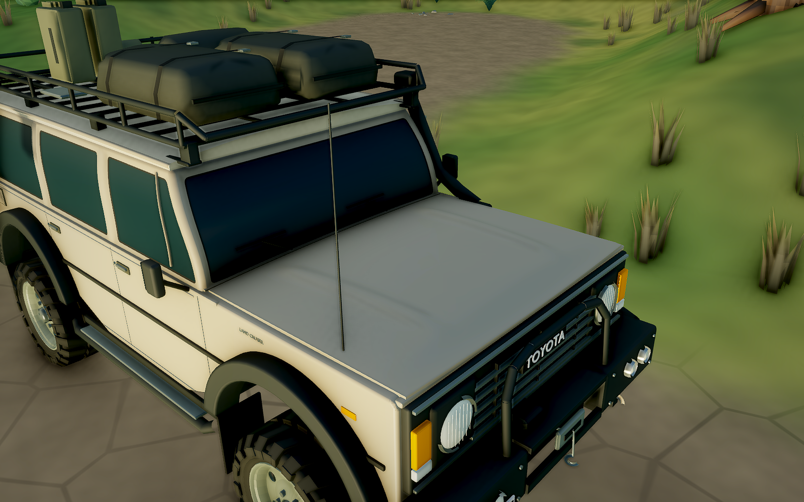

# Toyota 样车 · 引擎盖与车柱曲面精修

> 历史记录：此版本的弯曲车柱和玻璃已由[直柱平窗版本](TOYOTA-FLAT-GLAZING.md)替代。以下图片和测试保留当时结果；引擎盖与车顶曲面继续保留。

本轮在第一版样车上继续修改大构件的实际形状：引擎盖有双向拱度、纵向冲压筋与下翻前缘，车柱逐渐弯折、向车顶收分，窗角与车顶接合更圆顺。继续使用旧版风格的深色玻璃、哑光车漆、厚轮胎与探险装备。

[八个视角的同机位对照](toyota-trail/02-curved-panels/index.html) · [引擎盖近景](toyota-trail/02-curved-panels/20260926-proof-02/sample-hood.png) · [车柱近景](toyota-trail/02-curved-panels/20260926-proof-02/sample-pillar.png) · [实机悬挂视频](toyota-trail/02-curved-panels/20260926-proof-02/suspension.mp4)



## 实际修改

- **引擎盖**：横向与纵向都有拱度，两条渐收的浅压筋直接塑进同一张曲面，靠近两端时自然消退。前缘下翻，周边与底面闭合；后方导水板随引擎盖弧面连接，间隙沿曲线走向。
- **车柱**：A 柱根部接近直立，向上逐渐后倾并融入车顶；侧柱在高度方向逐渐内收，具有轻微弧度。保留第一版的整体高度与视觉体量。
- **窗框**：玻璃开口使用连续圆角，角部与窗柱共享边界，密封条顺着开口收边。雨刷和前门三角窗分隔条按同一曲面定位。
- **车顶**：低矮双向拱面、圆润肩部与浅压筋；雨槽顺着屋顶弧度走，行李架前脚增加贴合车顶的支承片。
- **曲面质量**：玻璃内部充分细分，修复粗大三角面造成的实机阴影痕迹；使用曲面切线计算法线，让反光连续。车漆与玻璃材质参数沿用第一版。

外观查阅了 [Toyota 官方 FJ60 档案](https://www.toyota-global.com/company/history_of_toyota/75years/vehicle_lineage/car/id60013889/)与 [Toyota UK 的 60 系修复车照片](https://mag.toyota.co.uk/60-series-land-cruiser-next-big-thing/)，检索日期为 2026-09-26。后者是 FJ62，主要用于观察板件弧面与窗角接合；样车保留低车顶。曲率和压筋幅度为本项目的风格化建模取值，未使用原厂模具数据。

## 装配与运行

游戏中的 Toyota 继续使用 `vehicle_toyota_trail`，挂点 JSON 标记 `revision=02-curved-panels`。完整近景装配 **172,252** 三角面，远景 **72,110**，车身本体 **99,264**。其余车轮与活动底盘零件保持上一版结构。

- **9 / 9 资产与物理检查通过**：导出尺寸、挂点、材质模式、LOD、弹簧形变、胎肩接地与插值状态。
- **9 种极限装配姿态通过**：原尺寸网格下的静态、全压缩、全伸展、交叉轴和满舵组合。
- **生产浏览器检查通过**：八组同机位对照，实际加载当前 GLB；四组独立弹簧与减震器、制动器分离、LOD 往返切换、夜间灯光和实机交叉轴行驶。浏览器错误为 0。
- **驾驶参数及运行代码保持一致**：与第一版交付的哈希记录核对了游戏初始化、相机、车辆配置、物理和车辆渲染代码；尺寸、车灯、拖点和悬挂挂点也逐项一致。见 [连续性核对](toyota-trail/02-curved-panels/20260926-proof-02/continuity.json)。完整林道测试结果保留在第一版记录中。

实机记录采用 NVIDIA L4 / Vulkan，画布 1600 × 1000。具体悬挂行程与视频统计见 [浏览器记录](toyota-trail/02-curved-panels/20260926-proof-02/browser-report.json)，装配检查见 [本轮 clearance.json](../art/studies/toyota-trail/02-curved-panels/build-20260926-051716/clearance.json)。

独立试玩入口的静止近景检查中，游戏显示约 60 FPS，120 帧采样的 P95 帧间隔为 16.7 ms；该数字对应上述设备与场景。交互对照页的八个视角、拖动条键盘操作、390 px 手机布局和视频播放也已检查。见 [试玩检查](toyota-trail/02-curved-panels/20260926-proof-02/preview-check.json)与[对照页检查](toyota-trail/02-curved-panels/20260926-proof-02/comparison-check.json)。

交付对照绑定 `20260926-proof-02`，对比的是第一版样车与本轮曲面精修。相机、车辆姿态、光照和涂装相同，只替换显示资产；截图直接取自游戏画布。`20260926-proof-01` 保留为发现三角阴影痕迹时的中间记录。

## 文件与复现

- [当前 Blender 文件](../art/blender/vehicle_toyota_trail.blend) / [建模脚本](../art/blender/vehicle_toyota_trail.py) / [当前 GLB](../public/assets/models/vehicle_toyota_trail.glb)
- [本轮生成脚本快照](../art/studies/toyota-trail/02-curved-panels/build-20260926-051716/generator.py)
- [第一版样车快照与来源](../art/studies/toyota-trail/02-curved-panels/baseline.json)
- [本轮交付哈希](toyota-trail/02-curved-panels/manifest.json)

```bash
npm run assets:toyota
npm run test:rig
npm run build
npm run test:toyota:browser
npm run preview
```

建模预览和装配检查写入新的 `art/studies/toyota-trail/02-curved-panels/build-<时间>/`，浏览器检查写入新的 `docs/toyota-trail/02-curved-panels/<时间>/`，保留已有媒体与日志。浏览器工具仍支持 `PLAYWRIGHT_MODULE`、`FOREST_CHROMIUM`，可用 `TOYOTA_STUDY_OUT` 指定一个尚不存在的输出目录。试玩入口加 `?play&vehicle=toyota`。
