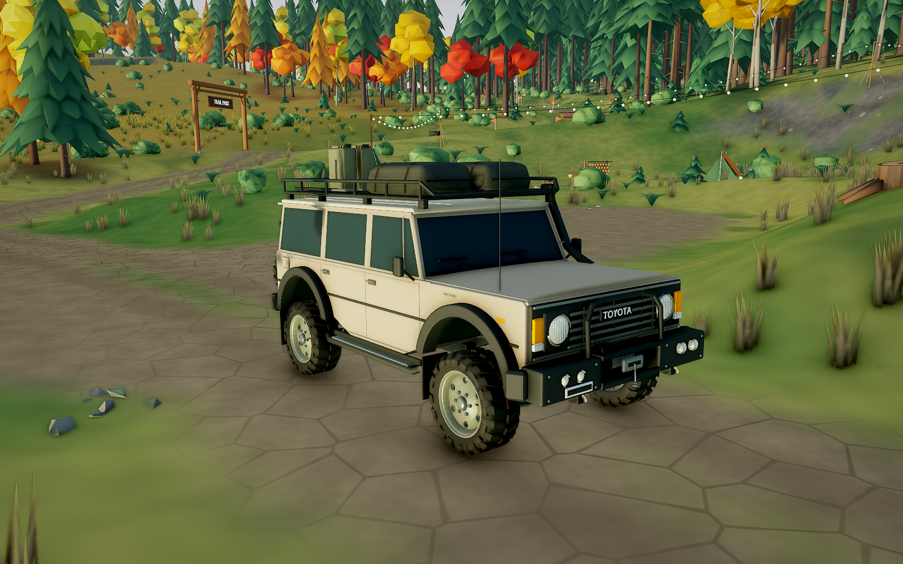

# Toyota FJ60 · 旧版风格精修样车

> 第一版样车记录。当前模型已继续完成[引擎盖与车柱曲面精修](TOYOTA-CURVED-PANELS.md)。本页的图片、测试与面数保留第一版结果；第一版的 [GLB](../art/studies/toyota-trail/02-curved-panels/before.glb)、[Blender 文件](../art/studies/toyota-trail/02-curved-panels/before.blend)和[生成脚本](../art/studies/toyota-trail/02-curved-panels/before.py)已单独保存。

当前第二辆车使用 `vehicle_toyota_trail`：从旧版 Toyota 的车身体量、厚轮胎、宽轮眉、深色车窗和探险装备出发，参考 FJ60 修整造型和接缝。车漆采用柔和反光，保持车辆与森林场景的大色块风格。这一轮只制作 Toyota 样车，供视觉方向评审。

[新旧同机位交互对照](toyota-trail/index.html) · [实机车头原图](toyota-trail/sample-front.png) · [驾驶视角](toyota-trail/sample-driving.png) · [悬挂行驶视频](toyota-trail/suspension.mp4)



## 旧版来源与车型参考

旧版来自本仓库提交 `33439c37d453c87279797d7365d8874cff5b747a`。用于对照的 GLB、挂点 JSON 与原生成脚本直接取自该提交：

- [`art/studies/toyota-trail/vehicle_toyota_legacy.glb`](../art/studies/toyota-trail/vehicle_toyota_legacy.glb)
- [`art/blender/reference/vehicle_toyota_v2.py`](../art/blender/reference/vehicle_toyota_v2.py)
- [`art/studies/toyota-trail/baseline.json`](../art/studies/toyota-trail/baseline.json)

[Toyota 官方 FJ60 车型档案](https://www.toyota-global.com/company/history_of_toyota/75years/vehicle_lineage/car/id60013889/)提供圆灯前脸、车窗与车身比例参考，轴距为 2.73 m。模型沿用游戏的越野升高、宽胎、保险杠、绞盘、行李架和后挂备胎配置；属于风格化探险改装车，不是原厂 CAD 复刻。模型自行创建，没有引入第三方车辆网格或贴图。

## 本轮精修

| 部位 | 处理 |
| --- | --- |
| 整体体量 | 保留旧版车壳、厚轮胎、宽轮眉、车顶装备；车顶略收窄，调整挡风玻璃和 A 柱倾角 |
| 前脸 | FJ60 横向格栅、内嵌圆灯、灯罩纹路、外侧琥珀色与白色灯具、位置清晰的 Toyota 铭牌 |
| 板件连接 | 单体车壳上切出约 6 mm 宽的浅凹门缝，发动机盖有厚度和轻微弧面；轮拱有内衬，窗框连成整体 |
| 车侧与车顶 | 前门三角窗、内凹门把手、连续雨槽、贴合 A 柱的通气管；行李绑带贴合袋体 |
| 车轮 | 保留宽胎块轮廓，细化轮圈圆周、冲压碟面、六个真实通风孔、轮母与气门嘴；备胎一致 |
| 材质 | 车漆粗糙度 0.56、clearcoat 为 0；橡胶更哑光，玻璃保留深色不透明效果，金属反光受控 |

近景完整装配 **126,570** 三角面，远景 **52,011**；面数包含四轮和完整活动底盘，排除隐藏的另一档 LOD。车身 53,582，单轮 12,736。距离超过 23 m 使用简化模型，回到 18 m 内恢复近景细节。

## 驾驶和悬挂

沿用现有 Toyota 的质量、轴距、轮距、动力、低档、转向、抓地、弹簧与阻尼参数；碰撞外廓及拖点匹配样车。保留上一轮已经实现的固定步长物理、姿态插值、胎肩接地探测和活动车桥碰撞体。

四组钢板弹簧独立形变，两端固定、中段跟随桥体；减震器筒体长度固定、活塞按行程伸缩，传动轴连接对应挂点，制动器随转向节运动。仍采用单车身刚体与多点轮胎探测，悬挂运动由实际行程驱动，未模拟独立簧下刚体或轮胎材料变形。

本轮还修正了装配检查中的一个漏检：独立形变弹簧使用复制后的网格，按网格身份筛选会漏掉轮胎与弹簧这一组检查；现在按装配零件名选择，再检查实际形变结果。

## 验证与证据

- **9 种样车极限姿态通过**：原尺寸网格，含全压缩、全伸展、交叉轴和满舵组合；检测覆盖的活动底盘与车身、轮胎与弹簧 / 桥体均无非安装干涉。见 [`clearance.json`](../art/studies/toyota-trail/clearance.json)。
- **9 / 9 资产及物理检查通过**：三辆当前选用资产的挂点、尺寸、材质模式、LOD、弹簧形变、胎肩接地、车桥碰撞体与插值状态。
- **Toyota 15 / 15 驾驶检查通过**：起步、制动、倒车、驻停、单轮凸起、交叉轴、坡道、泥地、侧倾、涉水、绞盘、复位与不同帧率输入。见 [`proving-results-toyota.json`](toyota-trail/proving-results-toyota.json)。
- **完整林道行驶**：加载全部静态碰撞体，行驶 1,667 / 1,671 m，326 s，0 次重置；最大连续低速停滞 0.22 s，最小朝上分量 0.96。终点容差 5 m。见 [`full-lap.txt`](toyota-trail/full-lap.txt)。
- **实机交叉轴录制**：约 12 s，左右悬挂最大行程差 0.261 m，最高 4.31 km/h，最小朝上分量 0.961，弹簧形变权重达到 0.576。镜头跟随行驶，没有设置车身或车轮姿态。
- **生产浏览器检查通过**：真实加载样车，四组独立弹簧与减震器、分离的制动器、深色不透明玻璃、无 clearcoat、LOD 往返切换；其余两车的透明材质正常，浏览器错误为 0。测试设备为 NVIDIA L4 / Vulkan，画布 1600 × 1000。见 [`browser-report.json`](toyota-trail/browser-report.json)。

交互页提供车头、侧面、近景接缝、车尾、驾驶镜头和夜景共六组对照。每一组在同一暂停场景中只替换显示资产，保持相同车身位置、车轮姿态、相机、环境时间和沙色涂装；因此是外观对照，不是两套历史物理版本的对比。所有原图直接取自游戏画布，没有后期修图。

这些测试确认装配和运行情况，整体美术效果仍以同机位对照与实际驾驶观感评审。

## 可编辑文件与复现

- [Blender 源模型](../art/blender/vehicle_toyota_trail.blend)
- [建模脚本](../art/blender/vehicle_toyota_trail.py)
- [游戏 GLB](../public/assets/models/vehicle_toyota_trail.glb) / [挂点与材质风格说明](../public/assets/models/vehicle_toyota_trail.json)
- [源码、资产与证据哈希](toyota-trail/manifest.json)

```bash
npm run assets:toyota
npm run test:rig
npx tsx tools/proving.ts toyota
VEH=toyota FULL=1 npx tsx tools/sim-test.ts lap
npm run build
npm run test:toyota:browser
npm run preview
```

浏览器检查需要可用的 Playwright 和 Chromium；安装在项目外时可通过 `PLAYWRIGHT_MODULE` 与 `FOREST_CHROMIUM` 指定路径。检查脚本从 `dist/` 启动临时服务，额外只映射旧版 Toyota 对照文件，不把历史模型放入游戏发布目录。视频原始输出是 WebM，对照页另提供 H.264 MP4 副本。

试玩 URL 加 `?play&vehicle=toyota` 直接进入样车；存档车辆 ID 继续使用 `toyota`。上一轮模型与媒体保存在原路径，当前样车和本轮证据使用独立路径。线上已发布版本未更新。
