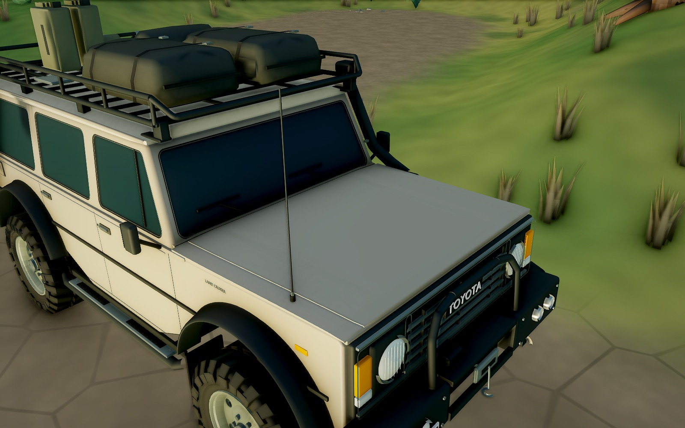

# Forest Trail · 三车原型细节精修

2026-10-07（Asia/Shanghai）。当前本地游戏使用本轮三辆 GLB：FJ60 为 `07-reference-surfaces`，Scout / Kestrel 为 `04-reference-surfaces`。

[打开三车前后对照](vehicle-detail/20261007/index.html) · [FJ60 机盖近景](vehicle-detail/20261007/toyota-after-hood.jpg) · [Defender 前部](vehicle-detail/20261007/scout-after-front.jpg) · [Hilux 前部](vehicle-detail/20261007/ranger-after-front.jpg)



## 本轮修改

FJ60 原有机盖把横向和纵向拱度叠加，导致中央鼓起；三车也共用了偏通用的面板、窗角或灯组处理。本轮分别依据原型重做这些构件，然后在原游戏相机、光照、涂装下逐车检查。

| 车辆 | 修改后的具体结构 |
| --- | --- |
| Toyota FJ60 | 宽平机盖沿纵向轻微下降，浅冲压折线融入同一张板；独立翼子板与机盖接缝、下翻前缘；圆角玻璃开口、凹入密封条与细金属压条；宽平车顶和滚圆肩部；补齐后柱通风口、圆顺轮眉截面、灯框、连续弯折通气管、贴合面板的天线底座。 |
| Scout / Defender 90 | 中央机盖和两侧水平翼子板分开；宽平机盖与贴合实际表面的铰链；独立灯翼、外侧圆形边灯、分离圆形尾灯和相应灯光挂点；翼面通风格栅；圆角平窗、车顶肩部和更多段数的轮眉回边。 |
| Kestrel / Hilux RN46 | 低矮、向前下降的机盖，两条纵向冲压线取代中央凸筋；四个凹入格栅分区、细外框和圆灯；圆角风挡与车门玻璃、渐变车顶肩部；修正门后通风口与倾斜侧面的贴合，细化涂装轮眉的连续截面。 |

三车轮胎的近景圆周增加到 64 段，保留粗胎纹、开孔钢轮圈、五 / 六螺栓差异及原有探险装备。材质继续使用哑光车漆、深色不透明玻璃、克制的金属反光，与森林的色块和细节密度保持一致。

## 原型来源与还原范围

检索和逐图核对日期：2026-10-07。参考照片用于观察，没有作为游戏贴图导入。

- [Toyota 原厂 FJ60 车型档案](https://www.toyota-global.com/company/history_of_toyota/75years/vehicle_lineage/car/id60013889/)及 [Toyota UK 60 系车型档案照片](https://media.toyota.co.uk/vehicles/land-cruiser-series-60-archive-1985/)：机盖、格栅、灯框、车顶、窗角和旅行车车身结构。
- [Toyota UK：1979 Hilux 4WD](https://mag.toyota.co.uk/in-focus-1979-toyota-hilux-4wd/)：双冲压线、早期四分区格栅、驾驶室、独立货斗与轮眉。项目保存的官方照片本轮重新逐图查看。
- [Land Rover 官方历史](https://www.landrover.com/defender-world/heritage/the-defender-story.html)、[传统 Defender 探险车实拍与来源记录](../art/studies/trail-companions/03-release-refinement/reference/NOTES.md)、[传统 Defender 灯具目录](https://www.masai4x4.com/doc/masai-product-catalogue-2016-edition.pdf)：经典车身分件、灯翼、圆形灯组和探险装备。

本轮对齐的是原型的识别性构件、分件关系、表面走势与装配细节。游戏仍采用既有升高悬挂、改装轮胎和探险装备；Scout / FJ60 / Hilux 的游戏轴距仍为 2.50 / 2.73 / 2.62 m。未取得统一标定照片或原厂 CAD，不能据此宣称逐像素误差为零或所有尺寸均为原厂尺寸。

## 实际验证

| 检查 | 结果与证据 |
| --- | --- |
| 实际 GLB 曲面 | 三车中央 72 cm 宽机盖区域各取 63 个垂直射线交点，确认主面没有再次形成中央鼓包；检查最终导出的三角面，不读取生成器函数。见 [曲面检查](vehicle-detail/20261007/surface-check.json)。 |
| 玻璃与 LOD | FJ60 / Scout / Hilux 的 8 / 8 / 4 块主车窗在近远两级模型均保持共面，近景每块窗边界保留 36 个顶点以构成圆角。见 [独立网格检查](vehicle-detail/20261007/companion-geometry.json)。 |
| 装配 | 三车各 9 种静止、全压缩、全伸展、交叉轴与满舵组合，27 / 27 通过；保持原尺寸网格检查。每次构建的 `clearance.json` 保存在本轮原始运行目录。 |
| 资产及物理回归 | 9 / 9 通过，包含尺寸、挂点、轮胎接地、车桥碰撞体、弹簧形变与插值。见 [回归结果](vehicle-detail/20261007/rig-check.json)。 |
| 驾驶试验场 | 45 / 45 通过：[Scout](vehicle-detail/20261007/proving-scout.json)、[Toyota](vehicle-detail/20261007/proving-toyota.json)、[Hilux](vehicle-detail/20261007/proving-ranger.json)。 |
| Toyota 完整环线 | 全静态碰撞体，1,667 / 1,671 m（终点容差 5 m），326 s，0 次复位，最大停滞 0.22 s。见 [原始输出](vehicle-detail/20261007/full-lap-toyota.txt)。 |
| 游戏内验证 | NVIDIA L4 / Vulkan，1600 × 1000；三车各 9 组相同机位前后对照，另有远景；确认真实 GLB、无 fallback、四组独立弹簧、灯光状态、LOD 往返和实际驾驶，无浏览器错误。见 [浏览器记录](vehicle-detail/20261007/browser-report.json)。 |
| 生产构建 | TypeScript 与 Vite 构建通过。保留既有 PlayCanvas `node:worker_threads` 浏览器兼容提示。 |

当前近景完整装配的三角面数：FJ60 214,920，Scout 256,948，Hilux 240,219。面数包含四轮与实际运动部件，未把隐藏的另一级 LOD 混算进去。远景仍使用简化模型。没有以本次显卡运行结果推断手机或低端设备的帧率。

配置、物理模拟和车辆渲染运行代码的 SHA-256 与修改前一致；上述试验场与整圈结果适用于保留的物理版本。最后的外观接缝和 Scout 尾灯调整后，重新执行了资产、曲面、装配、生产构建及三车浏览器检查。

## 文件与重建

- 生成源：[FJ60](../art/blender/vehicle_toyota_trail.py)、[Scout / Hilux](../art/blender/vehicle_release_refinement.py)、[共享曲面与窗框](../art/blender/vehicle_surfaces.py)。
- 当前可编辑源模型与 GLB 位于 `art/blender/vehicle_{toyota_trail,scout,ranger}.blend` 和 `public/assets/models/`。
- Toyota 的当前装配契约已写入 `art/vehicle-toyota-rig.json`，三车 sidecar 均使用仓库内稳定路径，重建检查不依赖某台机器的原始运行目录。
- [交付文件与哈希](vehicle-detail/20261007/manifest.json)。前后对照基线为本轮开始时的 `c6c74fbb24b63b7fa4f0da62d25e6a79115b46cc`；历史试作、原图与旧报告继续保留。

原始快照、参考照片、每次构建、PNG 与测试日志：`/mnt/runs/forest-trail/vehicle-detail-20261007-040318/`。本页引用的 JPEG 为同一帧游戏画布直接输出的轻量版本。

在 `game/` 中运行，输出路径应使用新的运行目录：

```bash
export FOREST_VEHICLE_BUILD_ROOT=/mnt/runs/forest-trail/<new-run>/builds
npm run assets:toyota -- -- --no-preview
npm run assets:companions
npm run test:surfaces -- /mnt/runs/forest-trail/<new-run>/surfaces.json
RIG_OUT=/mnt/runs/forest-trail/<new-run>/rig.json npm run test:rig
npm run build

# 需要冻结本轮起点的 GLB / JSON 于 baseline/game/public/assets/models/
VEHICLE_DETAIL_RUN=/mnt/runs/forest-trail/<new-run> npm run test:detail:browser
```

浏览器工具支持 `PLAYWRIGHT_MODULE` 与 `FOREST_CHROMIUM` 指向已有安装，`VEHICLES=toyota|scout|ranger` 可单独检查一辆车。本次交付为本地源码、游戏资产和验证材料更新。
