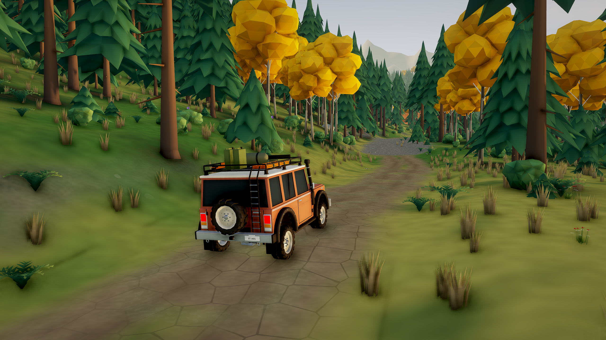
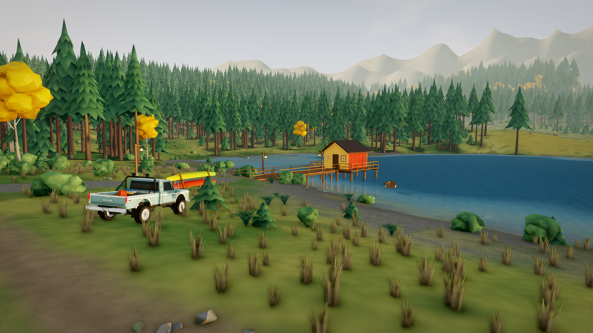
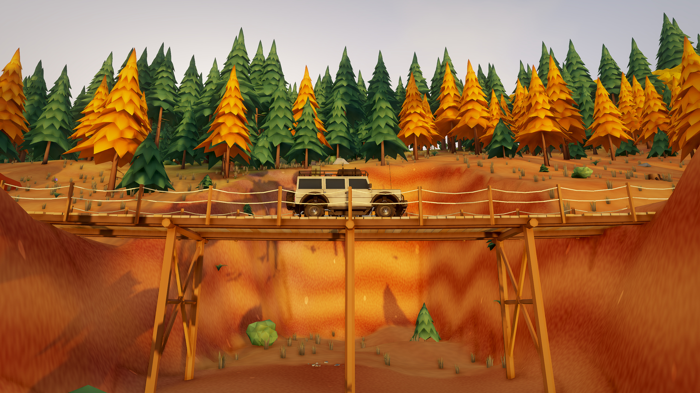
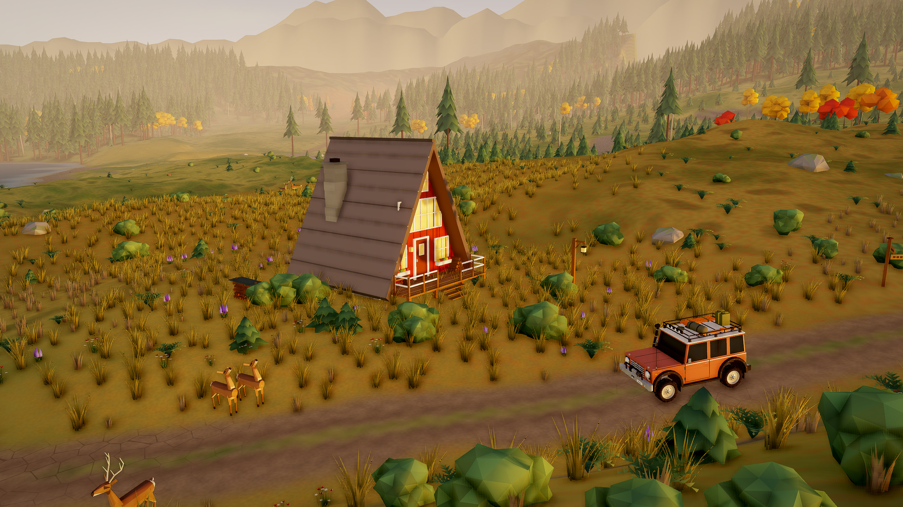
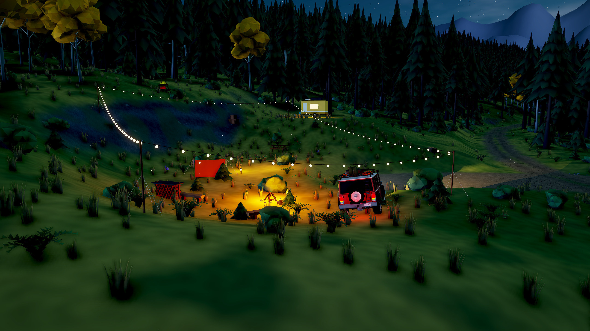

# Forest Trail · 横版实景图

5 张 **2560×1440（16:9）** 横版图片，直接从当前游戏的高画质场景取景，隐藏界面。点击图片可打开原图。

## 松林小径

Scout 驶入松林，沿起伏的林道向山谷深处前行。

## 湖畔船屋

Kestrel 停在湖边，木栈桥、船屋与远山一起入镜。

## 赤岩峡谷

Land Cruiser 60 位于木板吊桥中央，桥下是赤色沟壑。

## 秋林木屋

金色傍晚的 A 字木屋、林间公路与草甸上的鹿群。

## 星夜营地

越野车停在篝火旁，串灯与车灯照亮夜间营地。

[图集预览](preview.jpg) · [取景参数与文件校验记录](capture.json) · [返回游戏说明](../../../README.md)
